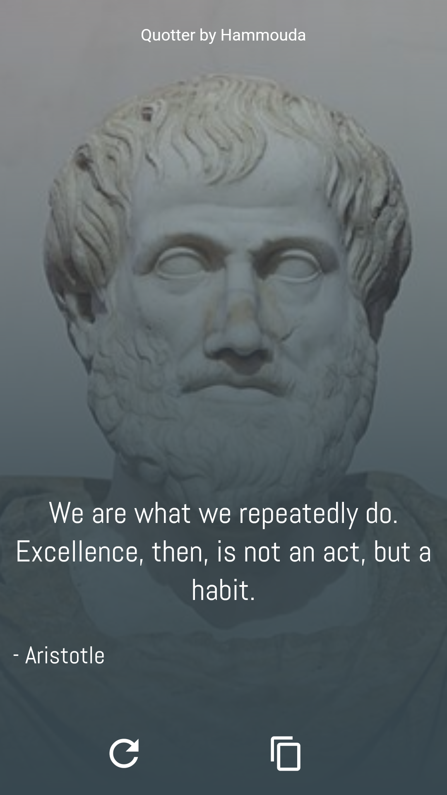
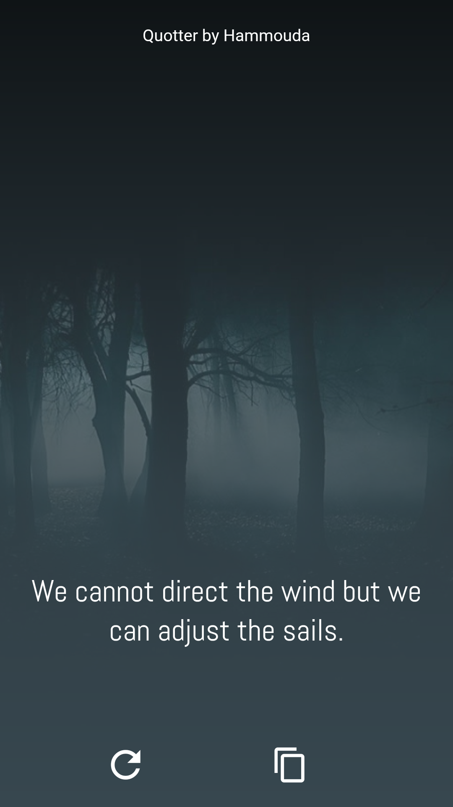

# Flutter Create

## Quotter ( Quote + Flutter )
Flutter app that displays random motivational quotes with a nice design and the
picture ( if possible otherwise show a local image ) of the person who said it, with the possibility
to copy the quote to share it with all your friends. 

|   |   |   |   |   |
|---|---|---|---|---|
|  |  |  |  |  |
|  |  |  |  |  |
|   |   |   |   |   |

## Technical Part
The app is using two Api :

- Quotes Api ( [Forismatic](http://forismatic.com/en/) )
- Picture Api ( [MediaWiki](https://en.wikipedia.org/w/api.php) )

the used libraries in this app are :
- [Http]([https://link](https://pub.dartlang.org/packages/http)) 
- [Clipboard_manager](https://pub.dartlang.org/packages/clipboard_manager)
- [Toast](https://pub.dartlang.org/packages/toast)
- [Flutter_launcher_icons](https://pub.dartlang.org/packages/flutter_launcher_icons)

[Playstore Link](https://play.google.com/store/apps/details?id=com.hammouda.Quotter).

## Note
- The app is rarely mistaking some names due to similarity or showing
other related picture to that person, the image is linked directly to
WikiMedia Api performance.
- All tests were conducted on Android only.

The app is developed by [Hammouda Elbez](https://www.linkedin.com/in/elbez-hammouda/)

Elbez.hammouda@gmail.com